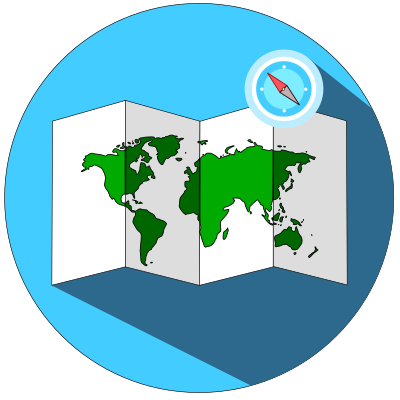
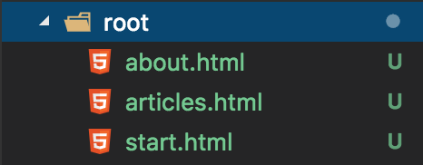

# navigator 

## A JS Single-Page Library

### Installation

Simply put the navigator.js file in your project folder
and link to it with a `<script>` tag:

```HTML
<script src="/path/to/navigator.js"></script>
```

If you want to work with the ES6 Module Syntax, then use navigator.es6.js.

### Usage

First you have to create a root folder for all your pages.
Then write another script to initialize the navigator:

```HTML
<script defer>
  /**
   * For ES6 Module Syntax use:
   * import { navigator } from 'navigator.js';
   *
   * and add type="module" to the script tag.
   */

  var nav = new navigator({
    root: "/path/to/root/folder", // your root folder
    links: "nav-link", // CSS Selector for nav links
    output: "[output]", // CSS Selector for the output element
    standard: "/start", // page to navigate to, if no page is refered in the URL
    extension: "php" // optional, standard value: "html", file extension to use, if backend languages are used
  });
</script>
```

Place all the `<script>` tags in your `<head>` element.

Now we can start writing some HTML.
First we create a header with navigation:

```HTML
<header>
  <ul id="nav">
    <li><nav-link href="/start">Start</nav-link></li>
    <li><nav-link href="/articles">Articles</nav-link></li>
    <li><nav-link href="/about">About</nav-link></li>
  </ul>
</header>
```

And add a little bit CSS:

```CSS
/* Basic Styles */

html,
body {
    font-family: Arial, Helvetica, sans-serif;
    padding: 0;
    margin: 0;
}

nav-link {
  color: #0366d6;
  text-decoration: none;
}

nav-link:hover, nav-link:active {
  text-decoration: underline;
}

/* Header */

header {
  width: 100%;
}

header ul#nav {
  list-style-type: none;
  margin: 5px 0;
  padding: 0 20px;
  display: flex;
  justify-content: space-around;
}
```

Next we need an output:

```HTML
<div output></div>
```

You can leave it empty or build a cool loading animation with it:

```HTML
<div output>
  <div id="loading">
    <svg
         width="36px"
         height="36px"
         xmlns="http://www.w3.org/2000/svg"
         viewBox="0 0 100 100">
      <g transform="rotate(17.3525 50 50)">
        <path
              d="M50 15A35 35 0 1 0 74.787 25.213"
              fill="none"
              stroke="#0055a5"
              stroke-width="12">
        </path>
        <path
              d="M49 3L49 27L61 15L49 3"
              fill="#0055a5">
        </path>
        <animateTransform
                          attributeName="transform"
                          type="rotate"
                          calcMode="linear"
                          values="0 50 50;360 50 50"
                          keyTimes="0;1"
                          dur="1.5s"
                          begin="0s"
                          repeatCount="indefinite">
        </animateTransform>
      </g>
    </svg>
  </div>
</div>
```

```CSS
/* Output */
[output] {
  width: 100%;
  max-height: 100%;
}

/* TIPP: You can also write styles for your pages here, e.g.:
  [output] #articles {
    margin: 5px 0;
    padding: 0 10px;
  }
*/

/* Loading Animation */

[output] div#loading {
  width: 100%;
  height: 100%;
  display: flex;
  justify-content: center;
  align-items: center;
}
```

You can now create your pages. Your root folder should look like this:


And now you're done.
**You have created your first _navigator_ project!**
